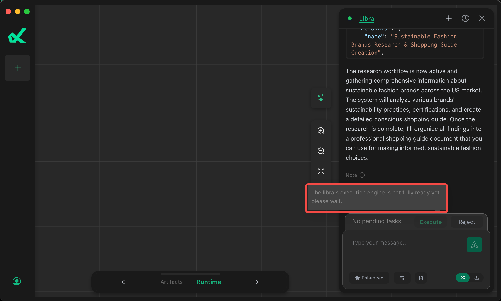

# Libra

[English](./README.md) | [中文](./README.zh-CN.md)

## Overview
The biggest differentiating capability of Libra.app compared to other AI Agent products is **localization**. The specific features and dependencies are as follows:
* **Local Mode**: All chats are sent to the local model, requiring the download of a low-bit LLM model optimized for macOS by GreenBitAI, approximately `2.5GB`.
* **Enhanced Mode**: Capable of autonomously performing complex tasks such as file searching, web browsing, programming, charting, and report generation. To better protect user's local data and environment, these operations run in an isolated container environment, requiring the download of a container runtime environment, approximately `1GB` in size.

## FAQ

### Network Proxy Configuration During Initialization

If you are in one of the following situations, you may need to configure a proxy to ensure that the local model, Enhanced mode, and local upload of documents in formats such as pdf, docx, xlsx can work properly:
* Corporate intranet
* Mainland China

Configure your proxy software to use global proxy mode, or add the following network addresses to the proxy whitelist rules:
* huggingface.co
* ghcr.io
* docker.io

After configuring the proxy, restart `Libra.app` and wait about 10 minutes (readiness time depends on your network). You can confirm whether the above issues exist through the Libra.app interface, or verify more specifically by executing the following commands in the macOS `Terminal` app.

After initialization is complete, it is recommended to disable the proxy.

> Note: Some proxy software has features like "virtual network card" or "TUN" mode. These modes need to be disabled when using Libra.

* Confirm if the local model has been downloaded:
```
du -hd0 ~/.cache/huggingface/hub/models--GreenBitAI--Qwen3-4B-Instruct-2507-layer-mix-bpw-4.0-mlx
```

If you see the following content, it indicates the local model has been downloaded correctly:
```
2.5G    /Users/libra/.cache/huggingface/hub/models--GreenBitAI--Qwen3-4B-Instruct-2507-layer-mix-bpw-4.0-mlx
```


* Confirm if the container runtime environment is ready:
```
/Applications/Libra.app/Contents/Resources/bin/limactl shell libra nerdctl images
```

If you see the following content, it indicates proper initialization:
```
REPOSITORY                         TAG       IMAGE ID        CREATED        PLATFORM       SIZE       BLOB SIZE
ghcr.io/greenbitai/libra-runner    v0.6.3    59727661d104    2 days ago     linux/arm64    1.781GB    565.6MB
mcp/markitdown                     latest    ac2cdd96f844    10 days ago    linux/arm64    982.2MB    353.9MB
```


## Issue Descriptions

### Local Mode Cannot Be Used
Error message: `Loading Local Model`


Refer to [FAQ](./README.md#faq)


### Cannot Click Execute Button
Error message: `Execution Engine is not fully ready`



Refer to [FAQ](./README.md#faq)

### Unable to Parse Uploaded PDF Files
Error message: `The file content is either empty`


Refer to [FAQ](./README.md#faq)


