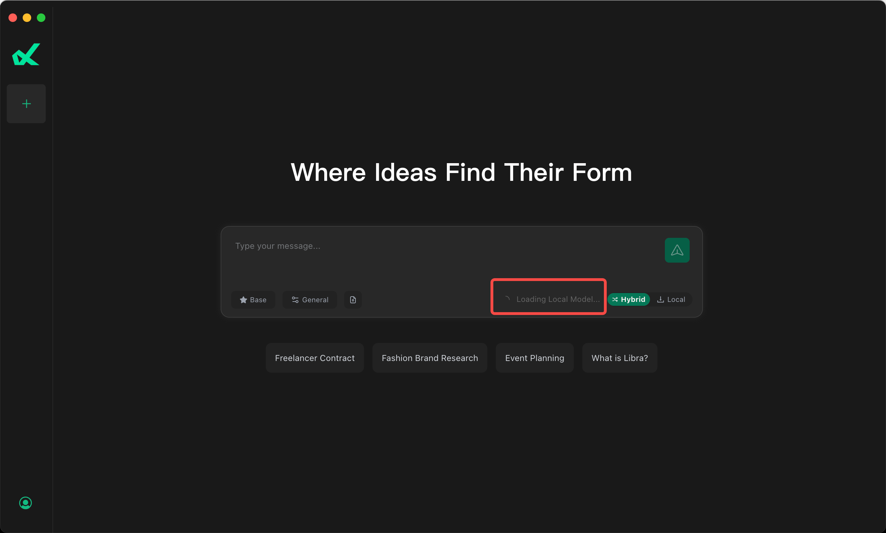
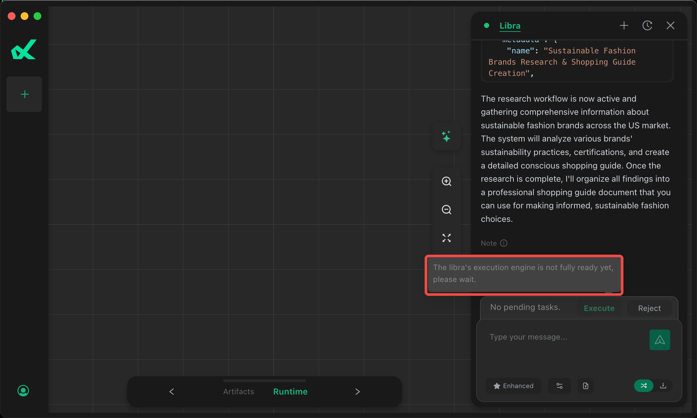
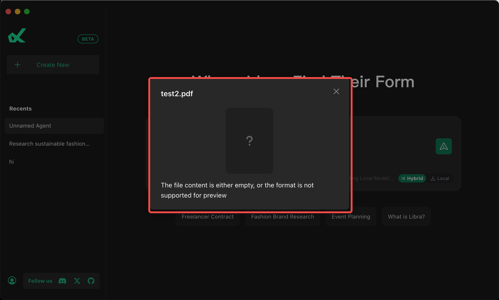

# Libra

[English](./README.md) | [中文](./README.zh-CN.md)

## 概述
由于Libra.app相比其他同类AI Agent产品来说，最大差异化能力在于**本地化**，具体的特性和其依赖说明如下：
* **Local模式**: Chat都会发送到本地模型，因此需要下载由GreenBitAI针对macOS优化的低比特LLM模型，大约`2.5G`左右。
* **Enhanced模式**：能自主的进行文件查找、联网搜索、编程绘图、报告生成等复杂指令，为了更好保护用户本地数据和环境，这里通过容器运行环境进行了隔离，因此需要下载容器运行环境，大约`1G`大小。

## FAQ

### 初始化阶段网络代理配置

如果您是如下情况之一，可能需要配置代理，以保障本地模型、Enhanced模式、本地上传pdf,docx,xlsx等格式文档能正常工作。
* 公司内网
* 中国大陆


代理软件使用全局代理，或者将以下网络配置在代理白名单规则：
* huggingface.co
* ghcr.io
* docker.io

配置好代理后，重启`Libra.app`,等待10min左右（就绪时长取决于您的网络），可以通过Libra.app界面确定上述问题是否存在，或者通过在macos中的`Terminal`APP中执行如下命令来更具体的进行确认。

初始化完成后，建议关闭代理使用。

> 注意：某些代理软件有类似 "虚拟网卡"，"TUN"模式，使用Libra的时候需要关闭这两种模式。

* 确认本地模式是否下载完成：
```
du -hd0 ~/.cache/huggingface/hub/models--GreenBitAI--Qwen3-4B-Instruct-2507-layer-mix-bpw-4.0-mlx
```

看到如下内容则表明本地模型已经正确下载：
```
2.5G    /Users/libra/.cache/huggingface/hub/models--GreenBitAI--Qwen3-4B-Instruct-2507-layer-mix-bpw-4.0-mlx
```


* 确认容器运行环境是否就绪：
```
/Applications/Libra.app/Contents/Resources/bin/limactl shell libra nerdctl images
```

看到如下内容则表明已经正确初始化：
```
REPOSITORY                         TAG       IMAGE ID        CREATED        PLATFORM       SIZE       BLOB SIZE
ghcr.io/greenbitai/libra-runner    v0.6.3    59727661d104    2 days ago     linux/arm64    1.781GB    565.6MB
mcp/markitdown                     latest    ac2cdd96f844    10 days ago    linux/arm64    982.2MB    353.9MB
```


## 现象说明

### Local模式无法使用
错误提示：`Loading Local Model`



参考 [FAQ](./README.zh-CN.md#faq)


### 无法点击Execute按钮
错误提示：`Execution Engine is not fully ready`



参考 [FAQ](./README.zh-CN.md#faq)

### 上传pdf等文件后无法解析

错误提示：`The file content is either empty`



参考 [FAQ](./README.zh-CN.md#faq)

